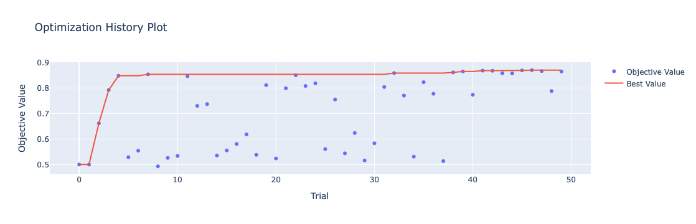
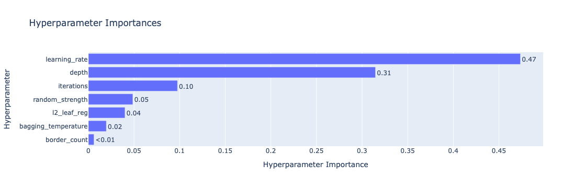

# Neural Lexus — Company Bankruptcy Prediction

A machine learning project aimed at **predicting the probability of company bankruptcy** using financial indicators, macroeconomic variables, and industry trends. The model is built using **CatBoost**

## Project Description

Bankruptcy risk assessment is a crucial task for banks, investors, insurers, and businesses. Our goal is to build an accurate and interpretable model to help stakeholders anticipate potential bankruptcies and minimize financial losses.

---

## Project Goal

- Develop a machine learning model for bankruptcy prediction.
- Integrate macroeconomic and industry data into the prediction pipeline.
- Improve risk analysis in corporate systems.

---

## Target Audience

- Banks and financial institutions  
- Investment funds  
- Insurance companies  
- Medium and large enterprises  

---

## Techstack

- Python  
- Pandas, NumPy  
- CatBoost  
- Scikit-learn (for metrics and evaluation)
- Optuna (Bayesian optimization) 
- Jupyter Notebook  

---

## The Model

We used the **CatBoostClassifier**, a gradient boosting algorithm developed by Yandex, known for its strong performance on tabular data, native support for categorical features, and robust generalization on small-to-medium-sized datasets.

#### Why CatBoost?

- Handles categorical features without manual encoding  
- Requires minimal preprocessing  
- Delivers high prediction accuracy  
- Resistant to overfitting due to built-in regularization  

## Hyperparameter Tuning with Optuna

To improve the performance of our CatBoost model, we performed hyperparameter optimization using **Optuna**.  
The goal was to **maximize the model's weighted accuracy** by tuning the following hyperparameters:

- `learning_rate`
- `depth`
- `l2_leaf_reg`
- `border_count`
- `bagging_temperature`
- `iterations`
- `random_strength`

We used **Bayesian optimization** via Optuna's `TPESampler`, and monitored the model's performance over multiple trials.

### Optimization History

The graph below shows how the model's objective (weighted accuracy) evolved throughout the optimization process:

As seen in the plot, the optimizer steadily improved the score and converged after several trials

### Parameter Importance

The plot below shows which hyperparameters had the most impact on the model's performance:

